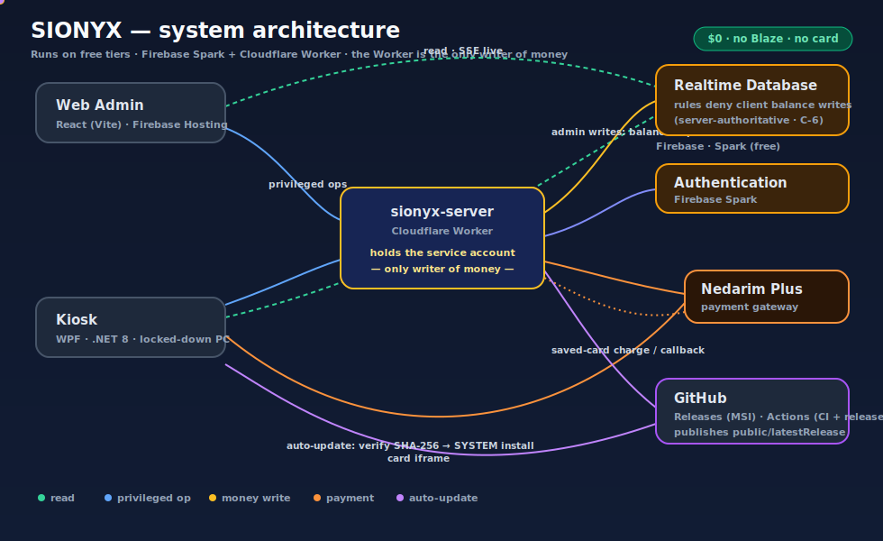
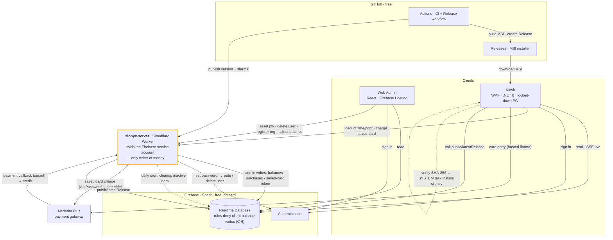

# SIONYX

Kiosk management system with web admin dashboard and WPF desktop app.

## Architecture

> **This is the source of truth for the app's services and how they talk to each other.**
> SIONYX runs entirely on **free tiers** — Firebase **Spark** (Realtime DB, Auth, Hosting) plus a
> **Cloudflare Worker** (`sionyx-server`) that replaces Cloud Functions. **No Blaze, no credit card.**
> The Worker is the only holder of the Firebase service account, so it is the **only writer of
> balances, purchases, and passwords** — money is server-authoritative and clients cannot self-credit.



### Services

| Service | Tech | Role | Cost |
|---|---|---|---|
| **sionyx-web** | React (Vite) | Admin dashboard; reads RTDB, calls the Worker for privileged ops | Firebase Hosting (free) |
| **sionyx-kiosk-wpf** | C# WPF (.NET 8) | Kiosk lockdown, sessions, printing, payments | on-prem |
| **sionyx-server** | Cloudflare Worker (TS) | All privileged logic: payments, password reset, org register, delete-user, balance deduct/adjust, cleanup cron | Workers (free, no card) |
| **Realtime Database** | Firebase | Source of data; rules deny client writes to balances | Spark (free) |
| **Auth** | Firebase | User sign-in; admin ops via the Worker | Spark (free) |
| **Nedarim Plus** | external | Card payments (hosted iframe + server-side saved-card charge) | gateway |
| **GitHub Releases + Actions** | external | Installer hosting; the release workflow publishes `public/latestRelease`; kiosk auto-update verifies SHA-256 and installs via a **SYSTEM scheduled task** (no UAC) | free |
| ~~functions~~ | Firebase Cloud Functions | All six ported to `sionyx-server`; last step is the [callback cutover](docs/CALLBACK-CUTOVER.md), then delete `functions/` (drops Blaze) | — |

### Data flow



The deployed Worker: `https://sionyx-server.sionyx-server.workers.dev`.
Migration details + re-fork guide: [SPARK-MIGRATION.md](SPARK-MIGRATION.md) · final ops step: [CALLBACK-CUTOVER.md](docs/CALLBACK-CUTOVER.md).

## Quick Start

### Prerequisites

- Node.js 22+
- .NET 8 SDK
- Firebase CLI

### Web Admin

```bash
cd sionyx-web && npm install && npm run dev
```

### Kiosk

```bash
cd sionyx-kiosk-wpf && dotnet run
```

## Makefile Commands

| Command | Description |
|---------|-------------|
| `make run` | Run kiosk desktop app |
| `make test` | Run kiosk tests |
| `make web-dev` | Run web dev server |
| `make web-test` | Run web tests |
| `make web-deploy` | Build and deploy to Firebase |
| `make release-patch` | Bug fix release (3.0.0 → 3.0.1) |
| `make release-minor` | Feature release (3.0.0 → 3.1.0) |
| `make release-major` | Breaking release (3.0.0 → 4.0.0) |
