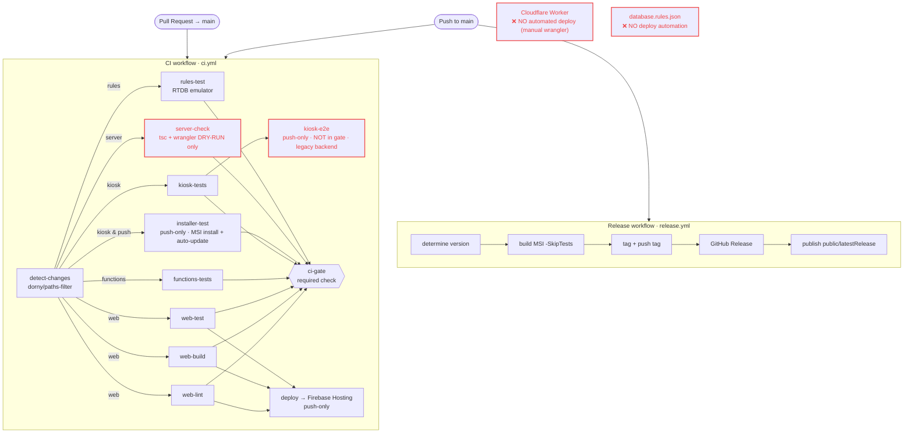
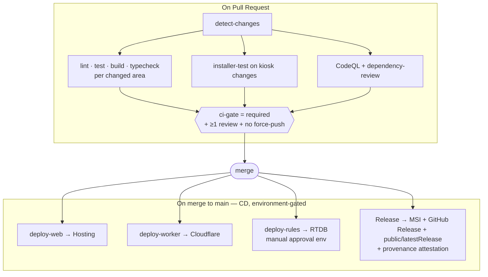

# SIONYX — CI/CD Audit

**Reviewer role:** Principal DevOps / CI-CD architect · **Date:** 2026-07-01
**Scope:** `.github/workflows/ci.yml`, `.github/workflows/release.yml`, branch protection, secrets, supply-chain.

## Executive summary

The pipeline is **better than average for a small project** — a single path-filtered `CI`
workflow with an aggregate `ci-gate` required check, plus a `Release` workflow. PR gating
is genuinely healthy (every PR runs the relevant jobs and must pass `ci-gate`).

But it has **two categories of real problems**:

1. **CD is incomplete and partly manual.** Only Firebase **Hosting** deploys automatically.
   The **Cloudflare Worker — the core backend and the only writer of money — has NO CD**
   (CI only does `wrangler deploy --dry-run`; real deploys are run by hand). **Database
   rules** also have no deploy automation. So "merge → deploy" is only ~⅓ true.
2. **Security/supply-chain hardening is largely absent** — no least-privilege
   `permissions`, actions pinned to mutable tags, no CodeQL/dependency-review/Dependabot,
   `allow_force_pushes: true` on `main`, and 0 required reviews.

Overall grade **at audit time: C+ / B-**. Nothing was on fire, but the backend-CD gap and
the force-push/least-privilege gaps were the sharp edges.

> ## ✅ Post-implementation status (2026-07-01)
>
> All Critical/High/Medium items were implemented across 4 PRs + repo-settings ops.
> **New grade: A-** (only gap: the Worker-CD token, a 2-minute user action below).
>
> | Item | Status |
> |---|---|
> | C1 · Worker CD | ✅ `deploy-worker` added (token-guarded) — **needs `CLOUDFLARE_API_TOKEN`, see below** |
> | C2 · force-push on main | ✅ disabled (ci-gate still required; 0-approval auto-merge preserved) |
> | H1 · installer-test gates PRs | ✅ runs on kiosk PRs now |
> | H2 · least-privilege | ✅ `permissions: contents: read` default in both workflows |
> | H3 · SAST + secret scanning | ✅ CodeQL (JS/TS + C#) + secret-scanning push protection + Dependabot alerts (dependency-review dropped — unsupported on this repo) |
> | H4 · CODEOWNERS / reviews | ✅ CODEOWNERS added; reviews kept at 0 to preserve auto-merge (deliberate) |
> | H5 · rules CD (manual approval) | ✅ `deploy-rules` behind the `production-rules` environment (required reviewer) |
> | M1 · SHA-pinned actions | ✅ + Dependabot keeps them current |
> | M2 · concurrency | ✅ cancels PR runs, never deploys |
> | M3 · firebase-tools pinned | ✅ `@15.22.4` |
> | M4 · NuGet cache | ✅ kiosk-tests + installer-test |
> | M5 · stale kiosk-e2e | ✅ removed |
> | M6 · release partial-state | ✅ atomic tag-via-release + rollback-on-failure |
> | M7 · dead secrets | ✅ `GCP_WIF_*` deleted |
> | M8 · Dependabot | ✅ actions + npm×4 + nuget |
> | L2/L3/L5 | ✅ SECURITY.md, job timeouts, MSI provenance attestation |
>
> ### The one remaining action — enable Worker CD
> `deploy-worker` is live but **skips (green no-op)** until a token exists:
> 1. Cloudflare → My Profile → API Tokens → **"Edit Cloudflare Workers"** template
>    (account `7e1d31c0047f99736fb25a8649cc273e`).
> 2. `gh secret set CLOUDFLARE_API_TOKEN --repo Danielsio/SIONYX` (paste the token).
>
> Then every `sionyx-server` change on `main` auto-deploys the Worker.
>
> ### Verify a release's provenance
> `gh attestation verify <the.msi> --repo Danielsio/SIONYX`

---

## 1. Current architecture



Red = gaps. `deploy` (Hosting) is the only real CD; Worker + rules deploys are manual.

---

## 2. Workflow inventory & purpose

### `ci.yml` (`CI`) — triggers: `pull_request` + `push` to `main`
| Job | Runs when | Purpose | Notes |
|---|---|---|---|
| `detect-changes` | always | Path filter (`web/functions/kiosk/server/rules`) → drives conditional jobs | Sound pattern. `kiosk` also matches `.github/workflows/ci.yml`. |
| `web-lint` / `web-build` / `web-test` | `web` changed | ESLint / Vite build / Vitest | 3 separate jobs each `npm ci` (dup). |
| `functions-tests` | `functions` changed | Jest for the (being-retired) Cloud Functions | Testing code slated for deletion. |
| `kiosk-tests` | `kiosk` changed | `dotnet test` (WPF) | Reliable. Destructive tests gated by `DEVMODE`. |
| `kiosk-e2e` | **push to main only** | E2E against a backend | ⚠️ **not in `ci-gate`**, points at **legacy `cloudfunctions.net`**. |
| `installer-test` | **push to main only**, `kiosk` changed | Build MSI, silent install, **auto-update SYSTEM-task upgrade** + tamper test, uninstall | ⚠️ **never runs on a PR** → installer regressions land on main. |
| `server-check` | `server` changed | `tsc --noEmit` + `wrangler deploy --dry-run` | ⚠️ **validates but never deploys** the Worker. |
| `rules-test` | `rules` changed | RTDB emulator rule tests (Java 21) | Good. No deploy. |
| `deploy` | **push to main**, `web` changed | Build web + `firebase deploy --only hosting` | ✅ real CD (now key-based auth). |
| `ci-gate` | always (`if: always()`) | Aggregate required check; fails on any `failure`/`cancelled`, passes on `skipped` | Correct aggregate pattern; **excludes `kiosk-e2e`**. |

### `release.yml` (`Release`) — triggers: `push` to main (`sionyx-kiosk-wpf/**`, `scripts/release/**`) + `workflow_dispatch`
Determine next version (from last `v*` tag) → build MSI (`-SkipTests`) → generate changelog →
tag + push tag → create GitHub Release (attach MSI) → publish `public/latestRelease` (URL+sha256).
✅ Now works (was 100% broken before 2026-07-01: flaky re-test + push to protected main).

---

## 3. Conformance to the desired flow

| # | Requirement | Status | Why |
|---|---|---|---|
| 1 | Every PR triggers the **complete** CI | 🟨 Partial | Path-filtered (fine), but `installer-test` + `kiosk-e2e` run **only post-merge**, so the full pipeline never gates a PR. |
| 2 | Cannot merge unless **every required check** passes | 🟨 Partial | `ci-gate` is required ✅, but installer/e2e are skipped on PRs (count as pass) → a kiosk change merges without them. |
| 3 | Merge to main → deployment | 🟥 Partial | Web ✅; **Worker ❌ (manual)**; **rules ❌**. |
| 4 | Deployment never from a PR | 🟩 Yes | `deploy`/`release` gated on `push` + `refs/heads/main`. |
| 5 | Failed deploy leaves no partial state | 🟨 Mostly | Hosting deploy is atomic ✅; `release.yml` has sequential tag→release→latestRelease with no rollback (partial-state risk). |
| 6 | Deterministic & reproducible | 🟨 Partial | Actions on mutable tags; `firebase-tools` unpinned (`npm i -g` / `npx --yes`). |

---

## 4. Findings & prioritized fixes

### 🔴 CRITICAL

**C1 — The Cloudflare Worker has no CD (backend drift).**
`server-check` only type-checks + dry-runs. Every backend change is deployed **by hand**
(`wrangler deploy`). Production can silently diverge from `main`; a reviewer approving a
server PR has no guarantee it ships. **Fix** — add a gated deploy job:
```yaml
  deploy-worker:
    runs-on: ubuntu-latest
    needs: [detect-changes, server-check]
    if: github.event_name == 'push' && github.ref == 'refs/heads/main' && needs.detect-changes.outputs.server == 'true'
    environment: production          # add required reviewers on this env
    permissions: { contents: read }
    steps:
      - uses: actions/checkout@v4
      - uses: cloudflare/wrangler-action@<pin-sha>   # v3
        with:
          apiToken: ${{ secrets.CLOUDFLARE_API_TOKEN }}
          workingDirectory: sionyx-server
```

**C2 — `main` allows force-pushes (`allow_force_pushes: true`).**
History can be rewritten, destroying the audit trail and enabling gate bypass. **Fix**
(one API call): disable force pushes + deletions on `main`.
```bash
gh api -X PUT repos/Danielsio/SIONYX/branches/main/protection/... \
  # or in the UI: Settings → Branches → main → uncheck "Allow force pushes"
```

### 🟠 HIGH

**H1 — `installer-test` / `kiosk-e2e` don't gate PRs.** Installer + auto-update
regressions reach `main` before they're tested (this literally happened on 2026-07-01).
Options: (a) run `installer-test` on PRs when `kiosk` changed (≈10 min, acceptable for a
release-critical path); (b) if kept post-merge, wire an **auto-revert on failure** so main
is never left broken. Add `kiosk-e2e` to `ci-gate` **or** delete it (see M5).

**H2 — No least-privilege `permissions`.** Only `deploy` and `release` set them; every
other job inherits the workflow-default `GITHUB_TOKEN` (write in many repos). **Fix** — top
of each workflow:
```yaml
permissions:
  contents: read      # default-deny; elevate per job (release: contents: write; attest: id-token/attestations)
```

**H3 — No SAST / dependency review.** No CodeQL (JS/TS + C#) and no PR dependency scanning.
**Fix** — add a `codeql.yml` (languages: `javascript-typescript`, `csharp`) and
`actions/dependency-review-action` on PRs; enable GitHub secret-scanning **push protection**.

**H4 — 0 required PR approvals.** Protection requires a PR but `required_approving_review_count: 0`
— "cannot merge unless reviewed" is not enforced. For a solo repo this is a deliberate
trade-off; if any collaborator joins, require ≥1 review + add `CODEOWNERS`.

**H5 — Rules deploy is unautomated + ordering-sensitive.** `database.rules.json` is tested
but never deployed by CI, and deploying it out of order breaks old clients. **Fix** — a
`deploy-rules` job gated behind a **GitHub Environment with a required reviewer** (manual
approval), so it's automated *and* controlled.

### 🟡 MEDIUM

- **M1 — Pin actions to full SHAs**, not `@v4/@v3` (mutable tags are a supply-chain vector).
  Pair with Dependabot `github-actions` updates.
- **M2 — No `concurrency`.** Rapid PR pushes run redundant CI. Add, but **exclude deploys**:
  ```yaml
  concurrency:
    group: ci-${{ github.ref }}
    cancel-in-progress: ${{ github.event_name == 'pull_request' }}
  ```
- **M3 — Pin `firebase-tools`** (`npm i -g firebase-tools@<ver>`, drop `npx --yes`) for
  reproducibility.
- **M4 — Cache NuGet** for kiosk/installer jobs (`actions/setup-dotnet` has no cache today →
  every run re-restores). Add `cache: true` + a `packages.lock.json`, or `actions/cache` on
  `~/.nuget/packages`.
- **M5 — `kiosk-e2e` targets the legacy backend** (`FUNCTIONS_BASE: …cloudfunctions.net`).
  Repoint at the Worker or delete it — it currently tests the wrong system and gates nothing.
- **M6 — `release.yml` partial-state risk.** Reorder so the **tag is the last** irreversible
  step, make `public/latestRelease` publish idempotent, and add `if: failure()` cleanup
  (delete a dangling tag) so a mid-run failure can't leave a tag with no release.
- **M7 — Hygiene:** remove now-unused `GCP_WIF_PROVIDER` / `GCP_SERVICE_ACCOUNT` secrets;
  move `serviceAccountKey.json` out of the repo working tree (it's gitignored, but a key on
  disk in the repo dir is one `.gitignore` slip from leaking).
- **M8 — Add Dependabot** (`npm` × the 4 lockfiles, `github-actions`, `nuget`).

### 🟢 LOW

- **L1** — Fold `web-lint`/`web-test`/`web-build` into one job (or reuse a built artifact) to
  cut 3× `npm ci`.
- **L2** — Add `CODEOWNERS`, `SECURITY.md`.
- **L3** — Add `timeout-minutes` to every job (default is 6 h; a hung emulator/E2E burns
  minutes).
- **L4** — Consider splitting the 40 KB monolithic `ci.yml` into reusable workflows
  (`workflow_call`) per area — only if it stops being readable.
- **L5** — Add build **provenance/attestation** for the MSI
  (`actions/attest-build-provenance`) so downloaders can verify it (pairs with the auto-update
  SHA-256 check).

---

## 5. Unnecessary / stale

- **`functions-tests`** — tests Cloud Functions that the migration is retiring; remove with
  the `functions/` deletion (post-cutover).
- **`kiosk-e2e`** — points at the legacy backend and gates nothing (**M5**): fix or delete.
- **`GCP_WIF_*` secrets** — dead after the key-based deploy switch (**M7**).

## 6. Missing workflows / gates

- **`deploy-worker`** (Cloudflare) — **the biggest gap** (C1).
- **`deploy-rules`** (Firebase RTDB rules) behind manual approval (H5).
- **CodeQL** + **dependency-review** (H3).
- **Dependabot** config (M8).
- **Secret scanning / gitleaks** (defense-in-depth given secrets are baked into the MSI).
- **PR `installer-test`** for kiosk changes (H1).

---

## 7. Proposed ideal architecture



**Principles applied:** default-deny `permissions`; SHA-pinned actions + Dependabot; every
merge deploys *its* area automatically; production deploys sit behind GitHub **Environments**
with required reviewers (so CD is automatic but controlled, and #4/#5 hold); concurrency
cancels stale PR runs but never a deploy; releases are idempotent with rollback on failure.

**Suggested order of work:** C1 → C2 → H2 → H1 → H3 → (rest). C1+C2+H2 are a few hours and
remove the sharpest edges (backend drift, force-push, over-broad tokens).
